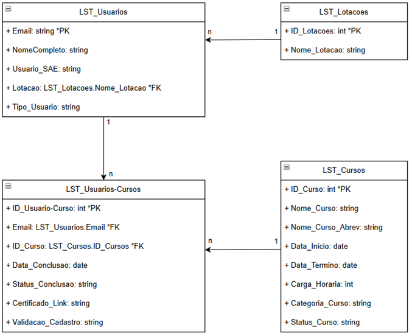

# Data Hub - ESAE


> Uma Plataforma para Análise de Usuários e Cursos, desenvolvida com Power Apps, Power Automate e Office Scripts para a ESAE-PGE/RS.

---

## 📖 Índice

1.  [**Sobre o Projeto**](#-sobre-o-projeto)
2.  [**Funcionalidades Principais**](#-funcionalidades-principais)
3.  [**Resultados Obtidos**](#-resultados-obtidos)
4.  [**Tecnologias e Arquitetura**](#-tecnologias-e-arquitetura)
5.  [**Estrutura de Pastas**](#-estrutura-de-pastas)
6.  [**Roadmap de Evolução**](#-pontos-de-atenção-e-roadmap-de-evolução)
7.  [**Documentação Detalhada**](#-documentação-detalhada)


---

## 🎯 Sobre o Projeto

O **Data Hub ESAE** é uma plataforma integrada e automatizada, construída sobre o ecossistema Microsoft Power Platform. O sistema foi projetado para centralizar, limpar, gerenciar e analisar todos os dados de participação em cursos e eventos oferecidos pela instituição, transformando relatórios brutos de múltiplas fontes (Moodle, listas SAE) em uma base de dados única, confiável e interativa.

Ele resolve o desafio de um processo anteriormente manual, demorado e sujeito a erros, que dependia de planilhas descentralizadas e dados inconsistentes.

---

## ✨ Funcionalidades Principais

* ✅ **Centralização de Dados:** Consolida informações de fontes distintas (Moodle, SAE) em uma base de dados única e padronizada.
* ✅ **Automação de ETL de Ponta a Ponta:** Automatiza todo o processo de Extração, Transformação (limpeza com Office Scripts) e Carga (sincronização com SharePoint via Power Automate).
* ✅ **Gestão e Visualização 360°:** Permite a visualização, pesquisa e filtragem do histórico de usuários e suas participações em cursos.
* ✅ **Sincronização Inteligente:** Gerencia o ciclo de vida dos registros, realizando operações de criação, atualização e inativação de forma automática.
* ✅ **Análise e Dashboards:** Oferece um cockpit de controle (Power App) com visões gerenciais, gráficos interativos e KPIs.
* ✅ **Auditoria de Dados:** Inclui funcionalidades e automações para reconciliar dados de diferentes fontes.
* ✅ **Fluxo da CGAJAPDI:** Automação completa para o processamento da lista de usuários SAE.

---

## 🚀 Resultados Obtidos

* ✅ **Automação Completa de Relatórios do Moodle**: Relatórios são processados e incluídos na base de dados de forma automática, prontos para serem consumidos por outros componentes da rede.
* ✅ **Automação Completa do Fluxo da CGAJAPDI**: Redução de 98% no tempo de processamento e verificação da lista de usuários, que antes era manual e demorava dias, para poucos minutos.
* ✅ **Relatórios de Power BI Atualizados**: Gestores agora têm conexão com uma base padronizada para atualização dos dashboards do Power BI, podendo verificar estatísticas iniciais dentro do próprio Power App.

---

## 🛠️ Tecnologias e Arquitetura

A arquitetura do sistema é baseada em quatro pilares principais, orquestrados pelo ecossistema Power Platform.

* **Pilar 1: Camada de Dados (SharePoint Online):** Atua como a base de dados central, utilizando um modelo relacional com listas interligadas.
* **Pilar 2: Camada de Transformação de Dados (Office Scripts):** Realiza a limpeza e padronização dos relatórios brutos.
* **Pilar 3: Camada de Orquestração e Automação (Power Automate):** É o motor que automatiza todo o fluxo de trabalho, executando scripts e sincronizando dados.
* **Pilar 4: Camada de Apresentação e Análise (Power Apps):** Serve como a interface para consulta, visualização e análise dos dados.

---

## 📁 Estrutura de Pastas

```
🏛️ Projeto-ESAE-Data-Hub/
├── 📁 Documentacao/
│    ├── 📁 Imagens/                     # Capturas de tela e diagramas utilizados nos documentos.
│    ├── 📁 Scripts/                     # Códigos-fonte (.ts) dos Office Scripts.
│    ├── 📜 Arquitetura_de_Dados.md      # Detalhes do Banco de Dados.
│    ├── 📜 Telas.md                     # Descrição funcional de cada tela do Power App.
│    ├── 📜 Fluxo_Auditor.md             # Descrição detalhada do fluxo auditor.
│    ├── 📜 Fluxo_Usuarios_Moodle.md     # Descrição detalhada do fluxo moodle.
│    └── 📜 Fluxo_SAE.md                 # Descrição detalhada do fluxo SAE.
│
├── 📜 CHANGELOG.md                      # Histórico completo de versões e alterações.
├── 📜 KNOWN_ISSUES.md                   # Lista de problemas conhecidos, bugs e limitações atuais.
└── 📜 README.md                         # Este arquivo: o ponto de partida e resumo do projeto.
```

---

## 📚 Banco de Dados

A camada de dados foi implementada utilizando **Listas do SharePoint Online**, configuradas para simular um modelo de banco de dados relacional.

Incluir esta parte e mover a montagem para um segundo documento

A camada de dados foi implementada utilizando **Listas do SharePoint Online**. As principais são:

* `LST_Usuarios`
* `LST_Cursos`
* `LST_Lotacoes`
* `LST_Usuarios_SAE`
* `LST_Usuarios-Cursos`

---

### 📊 Diagrama de Entidade-Relacionamento

O diagrama abaixo representa a estrutura relacional das listas do SharePoint da concepção do projeto.



---

## 🎯 Pontos de Atenção e Roadmap de Evolução

Esta seção documenta áreas que exigem monitoramento e possíveis melhorias futuras.

* **Escalabilidade da Camada de Dados:** A solução atual utiliza o SharePoint. Com o aumento massivo de volume de dados, uma futura evolução seria migrar a base para o **Microsoft Dataverse** ou um banco de dados **Azure SQL** para otimizar a performance em larga escala.
* **Limites de Delegação do Power Apps:** É crucial que todas as novas consultas e filtros no aplicativo sejam construídos utilizando funções delegáveis para garantir que toda a base de dados seja analisada, e não apenas os primeiros 2.000 (powerapp) / 5.0000 (sharepoint) registros.
* **Monitoramento e Tratamento de Erros:** Implementar um sistema de log e notificação mais robusto no Power Automate para capturar e relatar falhas durante o processo de sincronização de forma proativa.
* **Ferramenta de Mesclagem de Lotações:** Desenvolver a funcionalidade planejada para permitir que administradores unifiquem registros de lotações inconsistentes.

---

## 📄 Documentação Detalhada

Toda a documentação técnica e funcional do projeto foi separada em arquivos específicos para maior clareza e organização.

* **➡️ [Documentação Inicial do Projeto](./Documentacao/projeto_inicial_esae_data_hub.pdf):** Contém os detalhes da documentação de concepção do projeto.
* **➡️ [Documentação da Arquitetura](./Documentacao/Arquitetura_de_dados.md):** Contém os detalhes do Banco de Dados (listas do SharePoint) e a descrição técnica dos fluxos do Power Automate.
* **➡️ [Documentação das Telas](./Documentacao/Telas_do_aplicativo.md):** Contém a descrição funcional de cada uma das 20+ telas do Power App, com suas lógicas e imagens.
* **➡️ [Histórico de Alterações (CHANGELOG)](./CHANGELOG.md):** Registra todas as mudanças e novas funcionalidades a cada versão.
* **➡️ [Problemas Conhecidos (KNOWN_ISSUES)](./KNOWN_ISSUES.md):** Lista as limitações atuais e o roadmap de correções e melhorias.
* **➡️ [Descrição Detalhada do Fluxo Auditor](./Documentacao/Fluxo_Auditor.md):** Descrição de funcionamento e montagem do fluxo no power automate.
* **➡️ [Descrição Detalhada do Fluxo SAE](./Documentacao/Fluxo_SAE.md):** Descrição de funcionamento e montagem do fluxo no power automate.
* **➡️ [Descrição Detalhada do Fluxo Moodle](./Documentacao/Fluxo_Moodle.md):** Descrição de funcionamento e montagem do fluxo no power automate.

