# Data Hub - ESAE


Uma Plataforma para Análise de Usuários e Cursos do Moodle, desenvolvida em Power Apps, Power Automate e Office Scripts.

*Este Documento contém temporáriamente toda a Documentação*

*Proxima alteração ja deixará o documento separado em 5 Partes: Readme; Changelog; Know_Issues; Detalhamento_Telas; Arquitetura_Dados*

*Documentação Inicial utilizada para definição do projeto será adicionada posteriormente em .pdf*

---
## Índice
1. [Sobre](#sobre)
2. [Tecnologias Utilizadas](#tecnologias-utilizadas)
3. [Funcionalidades Principais](#funcionalidades-principais)
4. [Resultados Obtidos](#resultados-obtidos)
5. [Estrutura do Projeto](#estrutura-do-projeto)
6. [Banco de Dados](#banco-de-dados)
7. [Pontos de Atenção e Roadmap de Evolução](#Pontos-de-Atenção-e-Roadmap-de-Evolução)
8. [Descrição das Pastas](#descrição-das-pastas)
9. [Telas do Aplicativo - Descrição Funcional](#telas-do-aplicativo---descrição-funcional)
10. [Changelog](#changelog)
11. [Mudanças Futuras](#não-lançado---planejamento-para-próximas-versões)
12. [Versão 0.6.0 - WIP](#060---2025-00-00)
13. [Versão 0.5.0](#050---2025-09-19)
14. [Versão 0.4.0](#040---2025-08-28)
15. [Versão 0.3.0](#030---2025-08-04)
16. [Versão 0.2.0](#020---2025-07-10)
17. [Versão 0.1.0](#010---2025-06-22)
18. [Versão Conceitual - 2025-01-01](#Versão-Conceitual---2025-01-01)
19. [Know Issues](#know_issues---problemas-conhecidos-e-suas-limitações)
20. [Suporte](#-suporte)

---
# SOBRE

O **Data Hub ESAE** é uma plataforma integrada e automatizada, construída sobre o ecossistema Microsoft Power Platform. O sistema foi projetado para centralizar, limpar, gerenciar e analisar todos os dados de participação em cursos e eventos oferecidos pela instituição, transformando relatórios brutos de múltiplas fontes (Moodle, listas SAE) em uma base de dados única, confiável e interativa.

Ele resolve o desafio de um processo anteriormente manual, demorado e sujeito a erros, que dependia de planilhas descentralizadas e dados inconsistentes.

---
# Tecnologias Utilizadas

* **Microsoft Power Apps (Canvas App):** Para a camada de apresentação e interface do usuário.
* **Microsoft Power Automate:** Para a camada de orquestração e automação dos fluxos de trabalho.
* **Microsoft SharePoint Online:** Para a camada de dados (banco de dados relacional).
* **Microsoft Office Scripts (TypeScript):** Para a camada de transformação e limpeza de dados (ETL).

---
# Funcionalidades Principais

* ✅ **Centralização de Dados:** Consolida informações de fontes distintas (Moodle, SAE) em uma base de dados única e padronizada.
* ✅ **Automação de ETL de Ponta a Ponta:** Automatiza todo o processo de Extração, Transformação (limpeza com Office Scripts) e Carga (sincronização com SharePoint via Power Automate).
* ✅ **Gestão e Visualização 360°:** Permite a visualização, pesquisa e filtragem do histórico de usuários e suas participações em cursos.
* ✅ **Sincronização Inteligente:** Gerencia o ciclo de vida dos registros, realizando operações de criação, atualização e inativação de forma automática.
* ✅ **Análise e Dashboards:** Oferece um cockpit de controle (Power App) com visões gerenciais, gráficos interativos e KPIs.
* ✅ **Auditoria de Dados:** Inclui funcionalidades e automações para reconciliar dados de diferentes fontes.
* ✅ **Fluxo da CGAJAPDI:** Automação completa para processamento e verificação da lista de usuários SAE.

---
# Resultados Obtidos

* ✅ **Automação Completa de Relatórios do Moodle**: Relatórios são exportados, processados e incluídos em bases de dados de forma automática, prontos para serem consumidos por outros componentes da rede.
* ✅ **Automação Completa do Fluxo da CGAJAPDI**: Redução de 98% no tempo de processamento e verificação da lista de usuários, que antes era manual e demorava dias, para poucos minutos.
* ✅ **Relatórios de Power BI Atualizados**: Gestores agora têm conexão com uma base padronizada para atualização dos dashboards do Power BI, podendo verificar estatísticas iniciais dentro do próprio Power App.

---
```
# Concepção do Projeto e Análise Inicial

O desenvolvimento deste projeto foi guiado por um documento de análise e concepção inicial, elaborado em formato Word. Este documento serviu como a base para a definição do escopo, modelagem de dados e planejamento das funcionalidades.

Ele contém a primeira versão da arquitetura, os diagramas de entidade-relacionamento (DER) e os fluxogramas de atividades que nortearam as fases iniciais do desenvolvimento.

* **➡️ [Clique aqui para acessar o Documento de Concepção Inicial (PDF)](./Documentacao/Documento_Concepcao_Inicial.pdf)**
```
---
# Estrutura do Projeto

A arquitetura do sistema é baseada em quatro pilares principais, que representam as camadas lógicas da solução, orquestradas pelo ecossistema Power Platform.

* **Pilar 1: Camada de Dados (Onde a informação vive)**
    * **Tecnologia:** SharePoint Online
    * **Função:** Atua como a base de dados central do sistema, utilizando um modelo relacional implementado através de listas interligadas para armazenar as informações de forma estruturada.

* **Pilar 2: Camada de Transformação de Dados (Onde a informação é limpa)**
    * **Tecnologia:** Office Scripts
    * **Função:** Realiza a limpeza e padronização dos relatórios brutos recebidos, garantindo a qualidade e a consistência dos dados antes de serem carregados no sistema.

* **Pilar 3: Camada de Orquestração e Automação (Onde a mágica acontece)**
    * **Tecnologia:** Power Automate
    * **Função:** É o motor que automatiza todo o fluxo de trabalho. Ele executa os scripts de limpeza, lê os dados transformados e orquestra a sincronização com a camada de dados no SharePoint.

* **Pilar 4: Camada de Apresentação e Análise (Onde o usuário interage)**
    * **Tecnologia:** Power Apps
    * **Função:** Serve como a interface do usuário final (administradores e gestores). Permite a consulta, visualização e análise dos dados consolidados através de dashboards e ferramentas de pesquisa.

---
# Banco de Dados

A camada de dados foi implementada utilizando **Listas do SharePoint Online**, configuradas para simular um modelo de banco de dados relacional.


```
Incluir esta parte e mover a montagem para um segundo documento

A camada de dados foi implementada utilizando **Listas do SharePoint Online**. As principais são:

* `LST_Usuarios`
* `LST_Cursos`
* `LST_Lotacoes`
* `LST_Usuarios_SAE`
* `LST_Usuarios-Cursos`

### Diagrama de Entidade-Relacionamento

O diagrama abaixo representa a estrutura relacional das listas do SharePoint.


*(Para uma descrição detalhada de cada campo, consulte a documentação de arquitetura de dados.)*
```

### `LST_Usuarios`
**Descrição:** Armazena o cadastro único de todos os participantes que possuem registros no Moodle. É a tabela principal de "alunos" do sistema.

| Nome da Coluna | Tipo de Dado | Descrição / Propriedades |
| :--- | :--- | :--- |
| `Title` | Texto Simples | **Nome de Exibição:** `NomeCompleto`. Armazena o nome completo do usuário. |
| `PK_Email` | Texto Simples | Chave primária lógica para o usuário. Configurado para **valores exclusivos**. |
| `Lotacao` | Pesquisa (Lookup) | Aponta para o `ID` da lista `LST_Lotacoes` para garantir a padronização. |
| `Lotacao_Teams` | Texto Simples | Armazena o departamento do usuário, buscado do perfil do Microsoft 365 (Teams/Outlook). |
| `Tipo_Usuarios` | Escolha (Choice) | Define o vínculo do usuário (ex: "Servidor", "Estagiário", "Procurador do Estado"). |
| `Usuario_SAE_Lookup`| Pesquisa (Lookup) | Aponta para o `ID` da lista `LST_Usuarios_SAE` para criar um vínculo relacional. |
| `ValidarSAE` | Escolha (Choice) | Usada pelo fluxo "auditor". **Opções:** `Normal`, `AdicionarSAE`, `RemoverSAE`. |
| `QtdConclusoes` | Número | Armazena o total de cursos concluídos pelo usuário (preenchido por um fluxo). |

### `LST_Cursos`
**Descrição:** Armazena o catálogo de todos os cursos, eventos e capacitações oferecidos.

| Nome da Coluna | Tipo de Dado | Descrição / Propriedades |
| :--- | :--- | :--- |
| `Title` | Texto Simples | **Nome de Exibição:** `Nome_Curso`. Armazena o nome oficial do curso. |
| `PK_ID_Curso` | Número | Chave primária lógica do curso, vinda do Moodle. Configurado para **valores exclusivos**. |
| `Nome_Curto_Curso`| Texto Simples | Armazena o nome breve ou sigla do curso. |
| `DataInicioCurso`| Data e Hora | Data de início oficial do curso. |
| `DataTerminoCurso`| Data e Hora | Data de término oficial do curso. |
| `Carga_Horaria` | Número | Carga horária total do curso, calculada pelo Office Script. |
| `Categoria` | Escolha (Choice) | Categoria do curso (ex: "Cursos", "Palestras"), calculada pelo Office Script. |
| `QtdAlunos` | Número | Armazena o total de alunos que concluíram o curso (preenchido por um fluxo). |

### `LST_Lotacoes`
**Descrição:** Lista mestra que armazena os nomes únicos de todas as lotações para garantir a padronização e facilitar o gerenciamento.

| Nome da Coluna | Tipo de Dado | Descrição / Propriedades |
| :--- | :--- | :--- |
| `Title` | Texto Simples | **Nome de Exibição:** `Nome da Lotação`. Configurado para **valores exclusivos**. |

### `LST_Usuarios_SAE`
**Descrição:** Funciona como a "fonte da verdade" para a lista de usuários externos (SAE), que é sincronizada a partir de relatórios específicos.

| Nome da Coluna | Tipo de Dado | Descrição / Propriedades |
| :--- | :--- | :--- |
| `Title` | Texto Simples | **Nome de Exibição:** `NomeCompletoSAE`. |
| `Email_SAE` | Texto Simples | Chave primária lógica. Configurado para **valores exclusivos**. |
| `Lotacao_SAE` | Texto Simples | Lotação como vem no relatório SAE. |
| `Cargo_SAE` | Texto Simples | Cargo como vem no relatório SAE. |
| `Lotacao_Teams` | Texto Simples | Departamento do usuário, buscado do perfil do Microsoft 365. |
| `Cargo_Teams` | Texto Simples | Cargo do usuário, buscado do perfil do Microsoft 365. |
| `OrigemDados` | Texto Simples | Identifica o relatório de origem (ex: "CGAJAPDI-Servidores"). |
| `Status` | Escolha (Choice) | Ciclo de vida do usuário na lista. **Opções:** `Ativo`, `Inativo`, `Verificar!`. |
| `DataUltimaSincronizacao` | Data e Hora | Data em que o registro foi criado ou atualizado pela última vez pelo fluxo. |

### `LST_Usuarios-Cursos`
**Descrição:** Tabela de junção que cria o vínculo entre um usuário e um curso, registrando cada matrícula e seu status. É a lista mais importante para o histórico.

| Nome da Coluna | Tipo de Dado | Descrição / Propriedades |
| :--- | :--- | :--- |
| `FK_Usuario` | Pesquisa (Lookup) | Vínculo para o `ID` da lista `LST_Usuarios`. |
| `FK_Curso_ID` | Pesquisa (Lookup) | Vínculo para o `ID` da lista `LST_Cursos`. |
| `Data_Inscricao` | Data e Hora | Data em que a inscrição foi registrada. |
| `Data_Conclusao` | Data e Hora | Data em que o curso foi concluído. Fica em branco se apenas inscrito. |
| `StatusAluno` | Escolha (Choice) | Status da matrícula. **Opções:** `Inscrito`, `Concluído`. |
| `FK_Usuario_in_Text` | Texto Simples | **Otimização:** Cópia em texto do `ID` do usuário. Usado para filtros delegáveis. |
| `FK_Curso_in_Text` | Texto Simples | **Otimização:** Cópia em texto do `ID` do curso. Usado para filtros delegáveis. |

---
# Pontos de Atenção e Roadmap de Evolução

Esta seção documenta áreas que exigem monitoramento e possíveis melhorias futuras.

* **Escalabilidade da Camada de Dados:** A solução atual utiliza o SharePoint. Com o aumento massivo de volume de dados, uma futura evolução seria migrar a base para o **Microsoft Dataverse** ou um banco de dados **Azure SQL** para otimizar a performance em larga escala.
* **Limites de Delegação do Power Apps:** É crucial que todas as novas consultas e filtros no aplicativo sejam construídos utilizando funções delegáveis para garantir que toda a base de dados seja analisada, e não apenas os primeiros 2.000 (powerapp) / 5.0000 (sharepoint) registros.
* **Monitoramento e Tratamento de Erros:** Implementar um sistema de log e notificação mais robusto no Power Automate para capturar e relatar falhas durante o processo de sincronização de forma proativa.
* **Ferramenta de Mesclagem de Lotações:** Desenvolver a funcionalidade planejada para permitir que administradores unifiquem registros de lotações inconsistentes.

---
# Descrição das Pastas
```
Projeto-ESAE-Data-Hub/
├── Documentacao/Imagens      # Imagens utilizadas neste arquivo
├── Documentacao/Scripts      # Scripts utilizados nos fluxos
└── Readme.md                 # Este arquivo
```

---

```
Utilizar está descrição e seprar as telas para um arquivo próprio
# Telas do Aplicativo: Descrição Funcional

A documentação detalhada de cada tela, incluindo a descrição de suas funcionalidades, principais controles e lógicas de fórmulas, foi consolidada em um documento separado para maior clareza.

### ➡️ [Clique aqui para ver a Descrição Detalhada de Todas as Telas](./Documentacao/TELAS.md)
```

# Telas do Aplicativo - Descrição Funcional

Esta seção detalha o fluxo de navegação e as principais funcionalidades de cada tela do Data Hub ESAE.

---

**1. Tela Inicial (Dashboard Principal)**
>
> Funciona como o hub de navegação central do aplicativo. Apresenta os botões principais para acesso aos módulos de gestão (Usuários Moodle, Cursos, Usuários SAE) e aos relatórios (Histórico de Conclusões, Dashboards de BI). Inclui também um botão de atualização para sincronizar os dados com o SharePoint sob demanda.
>
> * **Funções e Lógicas Principais:**
>     * **`OnVisible`:** `Concurrent(Refresh(LST_Usuarios); Refresh(LST_Cursos); Refresh('LST_Usuarios-Cursos'))` para garantir que os dados dos contadores estejam sempre atualizados ao visitar a tela.
>     * **Controles de Botão (Texto HTML):** Usam a propriedade `HtmlText` para combinar texto, quebras de linha (`<br>`) e a contagem de itens em tempo real (`CountRows()`).
>     * **Navegação:** A propriedade `OnSelect` de cada controle utiliza a função `Maps()` para direcionar o usuário ao módulo correspondente.
>
> 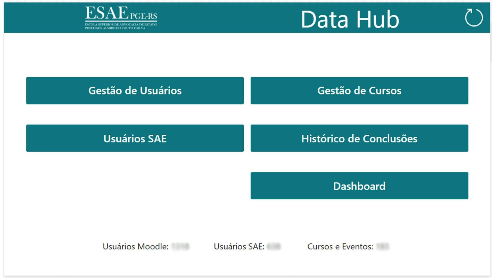

---

**2. Gestão de Usuários (Moodle)**
>
> Tela de gestão da lista principal de usuários (`LST_Usuarios`). Apresenta uma galeria com a listagem completa dos utilizadores, permitindo uma busca delegável por nome ou e-mail. A vista prévia de cada utilizador exibe informações chave como lotação, e-mail e status SAE. Ao selecionar qualquer utilizador, o administrador é direcionado para a sua tela de detalhes.
>
> * **Funções e Lógicas Principais:**
>     * **`OnVisible`:** `Reset(txtBuscaUsuario)` para limpar o campo de busca automaticamente.
>     * **`Items` (Galeria):** Utiliza uma fórmula `Filter` com o operador `in` para uma busca do tipo "contém" que é delegável: `Filter(LST_Usuarios; IsBlank(txtBuscaUsuario.Value) Or txtBuscaUsuario.Value in NomeCompleto)`.
>     * **`OnSelect` (Galeria):** `Set(gblUsuarioSelecionado; ThisItem);; Navigate(tela_detalhes_usuarios)` para guardar o registro selecionado e navegar.
>
> 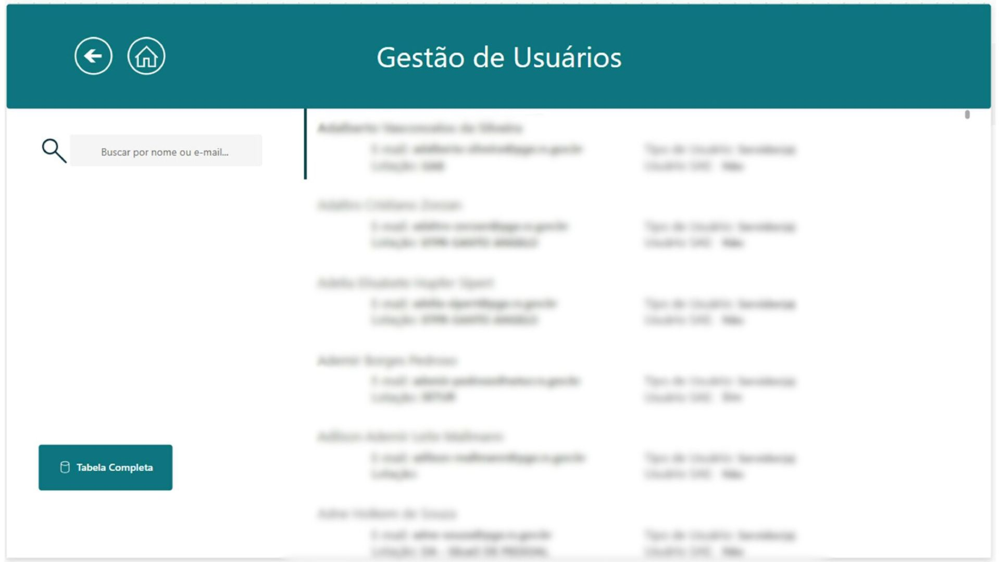

---

**3. Tabela de Usuários (Moodle)**
>
> Apresenta os mesmos dados da lista de gestão, mas em um formato de tabela densa, utilizando o controle Data Table. Esta vista é otimizada para a análise de um grande volume de dados na tela e serve de base para futuras funcionalidades de exportação.
>
> * **Funções e Lógicas Principais:**
>     * **Controle `Data Table`:** A propriedade `Items` é conectada à mesma fonte de dados filtrada da tela anterior para consistência.
>
> 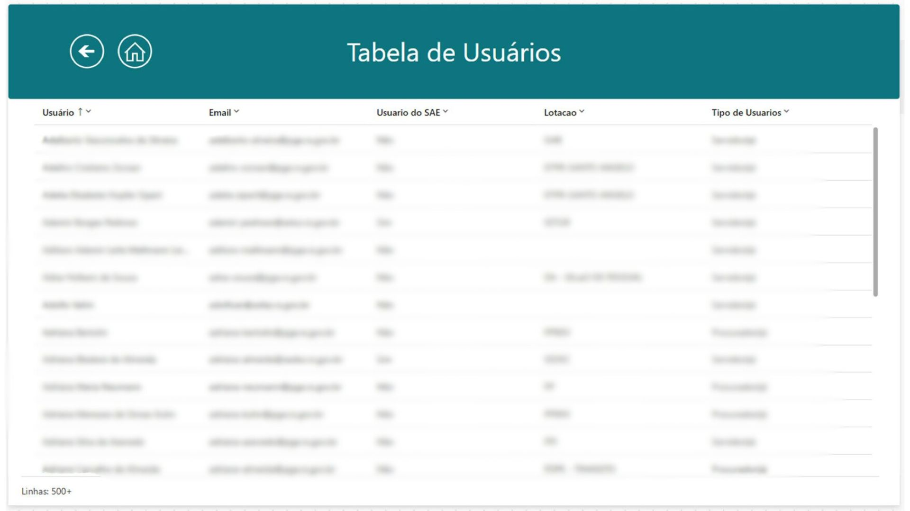

---

**4. Detalhes do Usuário (Moodle)**
>
> Oferece uma visão 360° de um utilizador selecionado. Um Formulário de Exibição no topo mostra todos os seus dados de perfil, enquanto uma galeria na parte inferior lista o histórico completo de todos os cursos em que o utilizador está inscrito ou que já concluiu.
>
> * **Funções e Lógicas Principais:**
>     * **`Item` (Formulário):** `gblUsuarioSelecionado` para exibir os dados do usuário.
>     * **`Items` (Galeria de Histórico):** Utiliza a coluna de texto otimizada (`FK_Usuario_in_Text`) para buscar de forma delegável todos os cursos de um usuário: `Filter('LST_Usuarios-Cursos'; FK_Usuario_in_Text = Text(gblUsuarioSelecionado.ID))`.
>
> 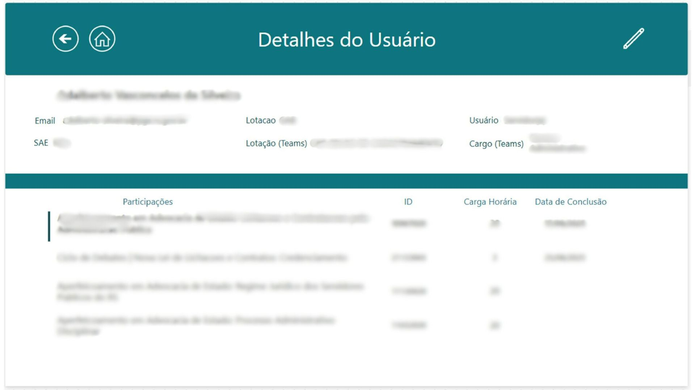

---

**5. Gestão de Cursos**
>
> Tela de gestão do catálogo de cursos (`LST_Cursos`), com uma interface e lógica semelhantes à tela de gestão de usuários. Permite a busca por nome ou ID do curso e a navegação para os detalhes de um curso específico.
>
> * **Funções e Lógicas Principais:**
>     * **`Items` (Galeria):** Utiliza uma fórmula `Filter` com `With` para uma busca universal que lida com texto (`in Nome_Curso`) e número (`PK_ID_Curso = NumeroBusca`).
>
> 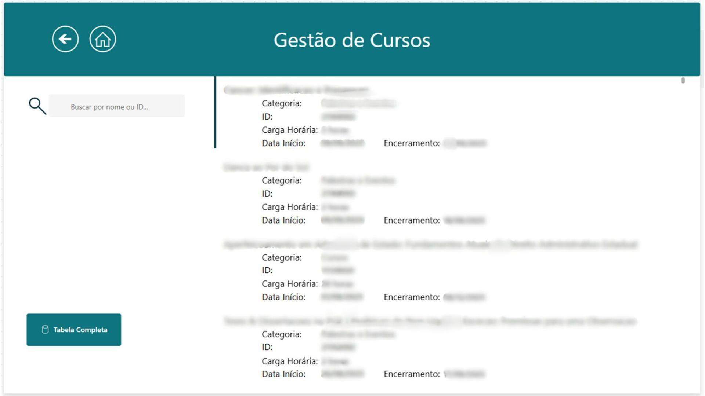

---

**6. Tabela de Cursos**
>
> Vista em formato de tabela do catálogo completo de cursos, otimizada para análise e futuras exportações.
>
> * **Funções e Lógicas Principais:**
>     * **Controle `Data Table`:** A propriedade `Items` é conectada à mesma fonte de dados filtrada da tela de gestão de cursos.
>
> 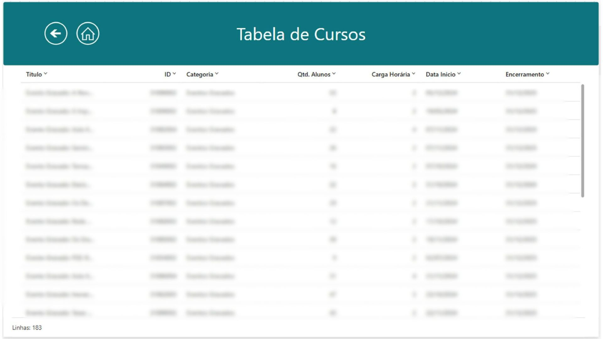

---

**7. Detalhes do Curso**
>
> Apresenta todas as informações de um curso selecionado (datas, carga horária, etc.) e, crucialmente, exibe uma galeria com a lista de todos os participantes que estão inscritos ou que já concluíram aquele curso.
>
> * **Funções e Lógicas Principais:**
>     * **`OnVisible`:** `ClearCollect(colAlunosDoCurso; Filter('LST_Usuarios-Cursos'; FK_Curso_in_Text = Text(gblCursoSelecionado.PK_ID_Curso)))` para carregar de forma performática e delegável apenas os alunos do curso.
>     * **`Items` (Galeria de Alunos):** A galeria é conectada à coleção local `colAlunosDoCurso`, tornando a rolagem instantânea.
>
> 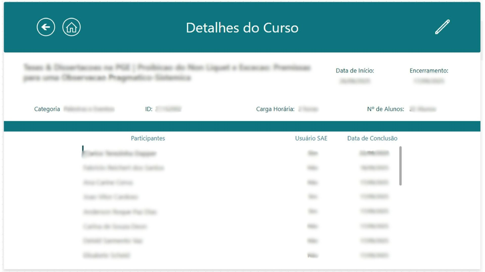

---

**8. Histórico de Conclusões Recentes**
>
> Tela de relatório que exibe todas as conclusões de cursos que ocorreram num período de tempo definido.
>
> * **Funções e Lógicas Principais:**
>     * **`OnSelect` (Botões de Filtro):** Botões como "Esta Semana" usam `UpdateContext` para definir variáveis de data (`varDataInicioFiltro`, `varDataFimFiltro`).
>     * **`Items` (Galeria):** A galeria é filtrada com base nessas variáveis de data: `Filter('LST_Usuarios-Cursos'; Data_Conclusao >= varDataInicioFiltro And Data_Conclusao < DateAdd(varDataFimFiltro; 1))`.
>
> 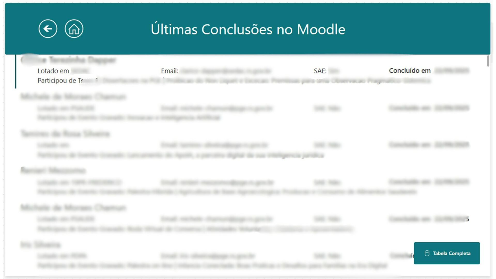

---

**9. Dashboard Interativo de Cursos (BI)**
>
> Tela de análise visual focado nos cursos. Apresenta um gráfico interativo (construído com uma galeria) que mostra os cursos mais populares.
>
> * **Funções e Lógicas Principais:**
>     * **Técnica "Galeria como Gráfico":** Utiliza uma galeria de altura flexível para simular um gráfico de barras.
>     * **`Width` (Barra do Gráfico):** `(Parent.Width * 0,7) * (ThisItem.QtdAlunos / Max(colTopCursos; QtdAlunos))` para desenhar barras proporcionais.
>     * **`OnSelect` (Galeria):** Permite clicar em uma "barra" e navegar para os detalhes daquele curso.
>
> 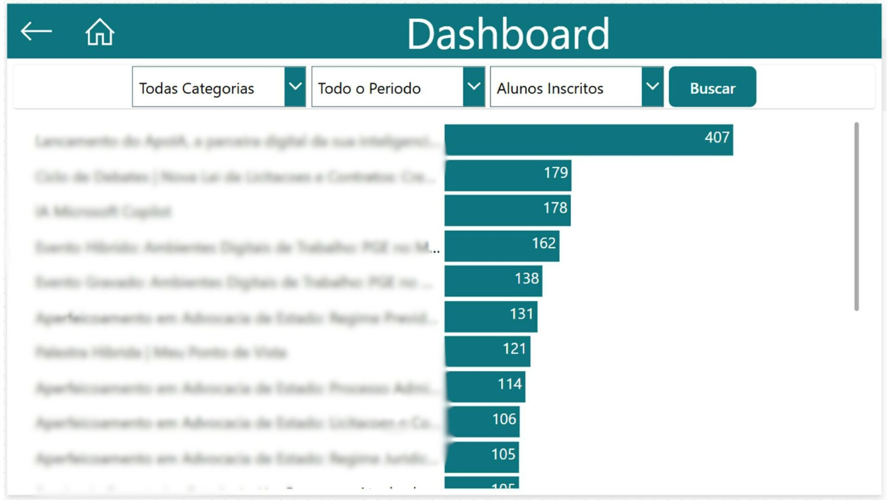

---

**10. Gestão de Usuários SAE**
>
> Tela principal para a gestão da lista de referência `LST_Usuarios_SAE`. Inclui uma galeria com filtros avançados que permitem ao administrador visualizar os utilizadores por `Status` e por `OrigemDados`.
>
> * **Funções e Lógicas Principais:**
>     * **`Items` (Galeria):** Utiliza uma fórmula `Filter` que combina a busca por texto com múltiplos menus suspensos de forma delegável.
>
> 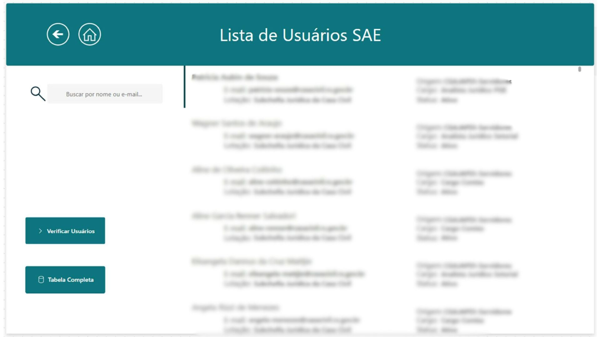

---

**11. Tela de Auditoria de Inconsistências**
>
> Tela de "ações necessárias" que exibe uma lista filtrada apenas com os utilizadores que o fluxo "auditor" do Power Automate sinalizou como tendo dados inconsistentes.
>
> * **Funções e Lógicas Principais:**
>     * **`Items` (Galeria):** Utiliza uma fórmula `Filter` para buscar na `LST_Usuarios_SAE`, mas com uma condição `LookUp` que verifica a coluna `ValidarSAE` na `LST_Usuarios`.
>
> 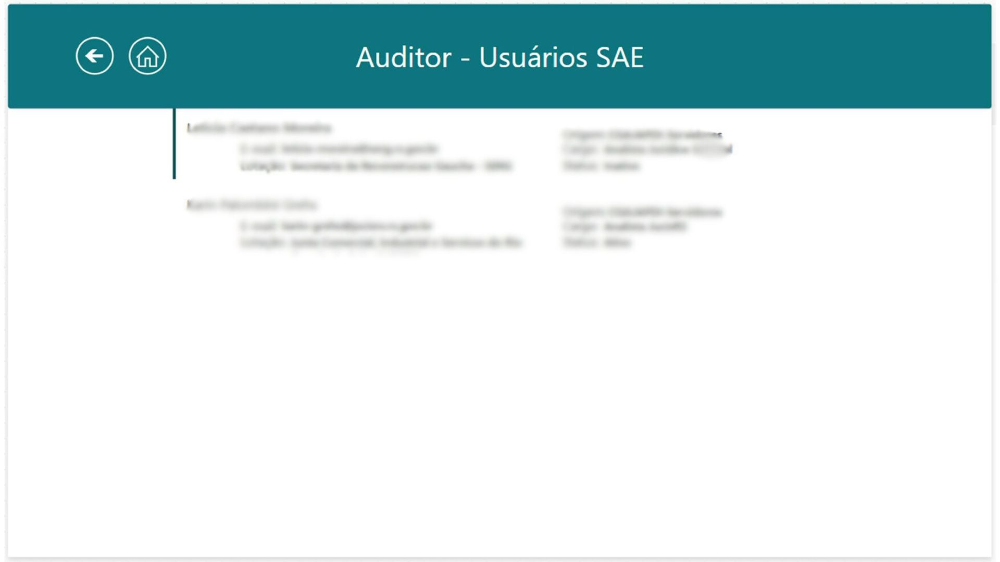

---

**12. Tabela Completa de Usuários SAE**
>
> Apresenta os dados da lista `LST_Usuarios_SAE` em um formato de tabela denso, otimizado para análise.
>
> * **Funções e Lógicas Principais:**
>     * **Controle `Data Table`:** A propriedade `Items` é conectada à mesma fonte de dados filtrada da tela de gestão SAE.
>
> 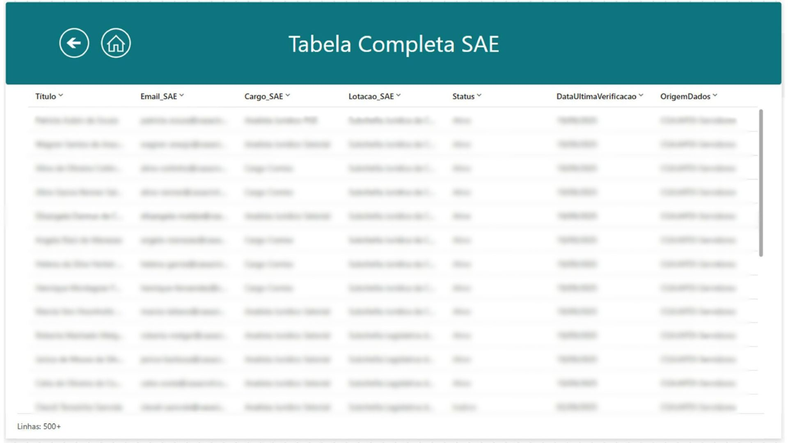

---

**13. Tela de Detalhes e Reconciliação (SAE vs. Moodle)**
>
> Tela de análise comparativa. Apresenta dois formulários lado a lado, mostrando as informações de um mesmo utilizador como estão na lista `LST_Usuarios_SAE` e como estão na lista principal `LST_Usuarios`.
>
> * **Funções e Lógicas Principais:**
>     * **`OnVisible`:** Usa `UpdateContext` para criar variáveis locais (`locSAEUser`, `locMoodleUser`) que armazenam os registros das duas listas, otimizando a performance.
>     * **`Visible` (Controles):** A visibilidade do formulário Moodle e de uma mensagem de "não encontrado" é controlada pela fórmula `IsBlank(locMoodleUser)`.
>
> 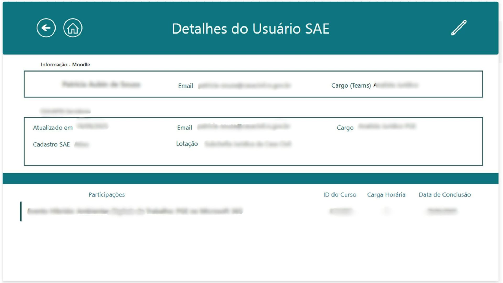

---

**14. Análise da Auditoria**
>
> Detalhe do fluxo de auditoria. Esta imagem exemplifica um utilizador que foi sinalizado como não inscrito na plataforma moodle.
>
> * **Funções e Lógicas Principais:**
>     * Esta é uma vista da tela de detalhes (13), onde a fórmula `IsBlank(locMoodleUser)` resultou em `true`, tornando a mensagem de alerta visível.
>
> 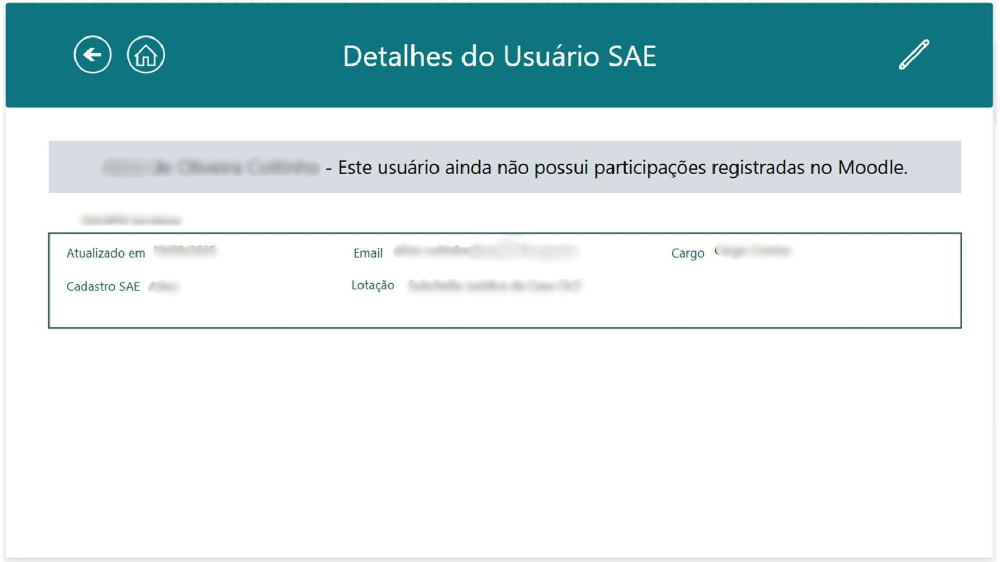

---

**15. Análise do Alerta (Inconsistência Tipo 2)**
>
> Segundo exemplo do fluxo de auditoria. A mensagem de alerta em amarelo destaca uma outra regra de negócio.
>
> * **Funções e Lógicas Principais:**
>     * Novamente uma vista da tela 13, mas aqui a visibilidade de um ícone de alerta ⚠️ é controlada por uma fórmula de comparação de status, como: `locMoodleUser.Usuario_SAE.Value = "Sim" && locSAEUser.Status.Value = "Inativo"`.
>
> 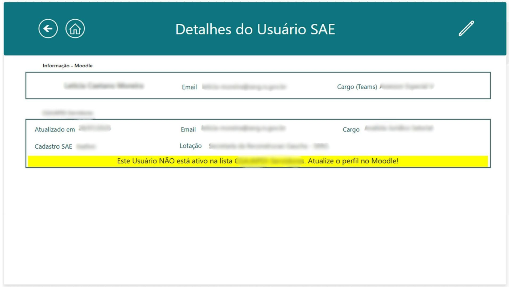

---

**16. Layout Responsivo para Dispositivos Móveis**
>
> Demonstração da interface do aplicativo refatorada com Contêineres Flexíveis, mostrando como o layout se adapta automaticamente para as orientações vertical e horizontal em um celular.
>
> * **Funções e Lógicas Principais:**
>     * **Configurações do App:** `Ajustar à escala = Desativado`.
>     * **Contêineres de Layout:** Uso de contêineres verticais e horizontais para organizar os elementos.
>     * **Propriedades Responsivas:** Uso extensivo de `Parent.Width`, `Fill portions` e fórmulas com `If(App.ActiveScreen.Size <= 1; ...)` para alterar o layout e o tamanho de fontes.
>
> 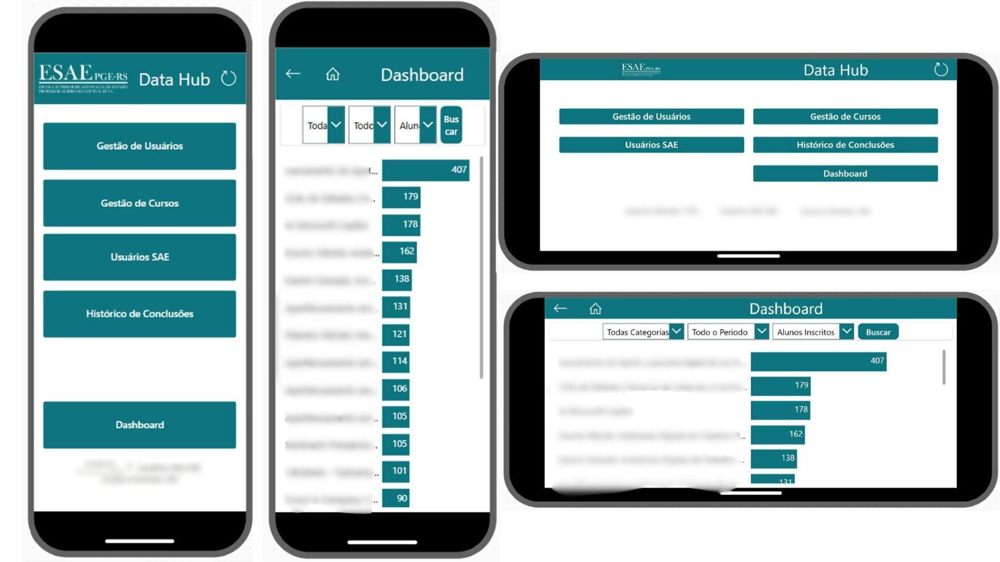

---

**17. Dashboard de BI (Power BI) - Tela Inicial**
>
> Tela principal do relatório no Power BI, que é integrado ao Power App. Apresenta os KPIs e os principais filtros.
>
> * **Funções e Lógicas Principais:**
>     * A integração é feita no Power App com um botão que usa a função `Launch("https://app.powerbi.com/...")` para abrir o relatório no navegador.
>
> 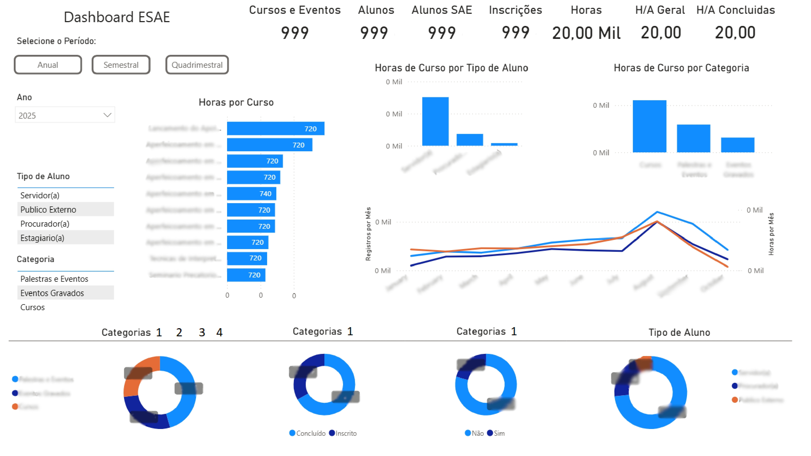

---

**18. Dashboard de BI - Análise Comparativa**
>
> Vista do relatório no Power BI que permite o estudo de campo amostral, cruzando dados administrativos com os dados de participação em cursos.
>
> * **Funções e Lógicas Principais:**
>     * A lógica de cruzamento de dados e os visuais são construídos com **DAX e Power Query** dentro do Power BI Desktop.
>
> 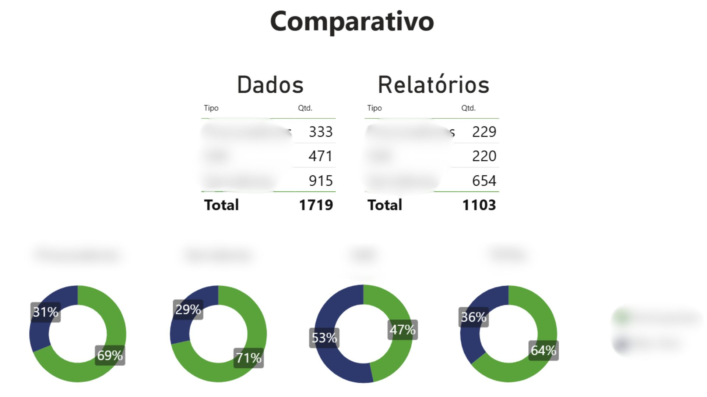

---

**19. Dashboard de BI - Distribuição por Lotação**
>
> Gráfico de barras ou pizza no Power BI que exibe a distribuição quantitativa de participantes por lotação.
>
> * **Funções e Lógicas Principais:**
>     * Visual de gráfico no Power BI, utilizando as colunas de Lotação e a contagem de usuários.
>
> 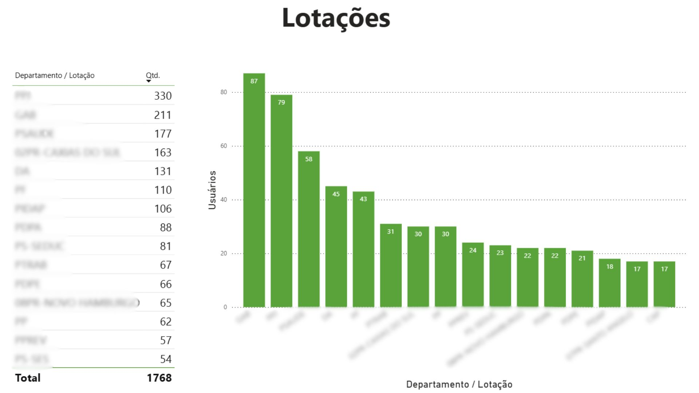

---

**20. Dashboard de BI - Distribuição por Cargo**
>
> Análise visual no Power BI que mostra a distribuição de participantes por cargo.
>
> * **Funções e Lógicas Principais:**
>     * Visual de gráfico no Power BI, utilizando as colunas de Cargo e a contagem de usuários.
>
> 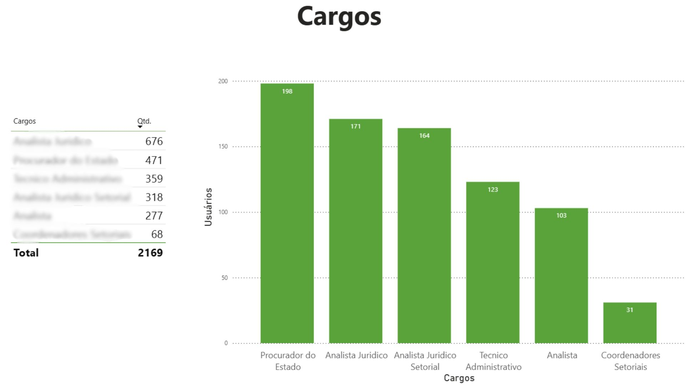

---

**21. Dashboard de BI - Análise Temporal**
>
> Gráfico de linhas no Power BI que exibe a evolução do número de inscrições e conclusões ao longo do tempo.
>
> * **Funções e Lógicas Principais:**
>     * Visual de gráfico de linhas no Power BI, utilizando as colunas de data e medidas de contagem (`COUNTROWS`) em DAX.
>
> 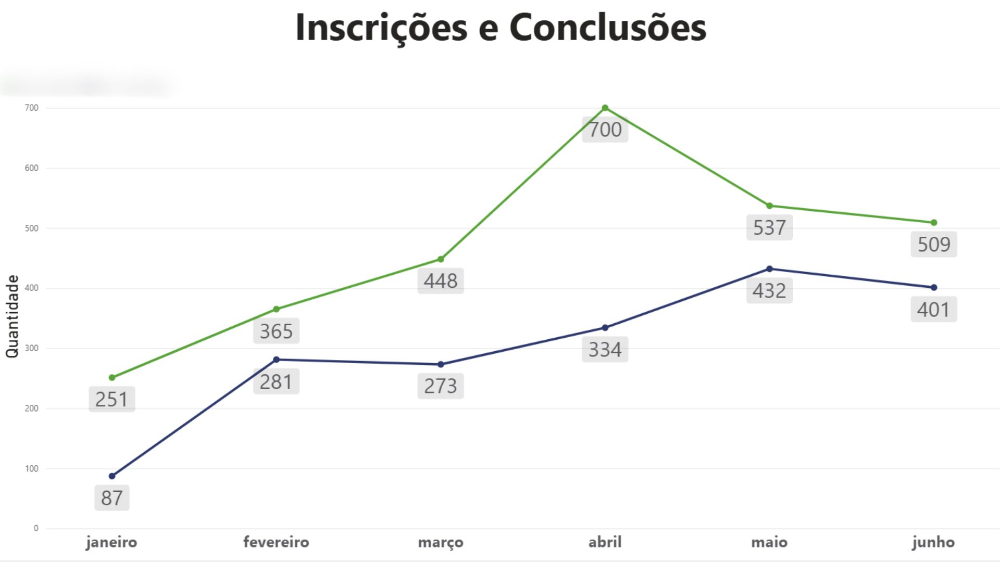

---
# CHANGELOG 

Todos as mudanças notáveis neste projeto estão documentadas neste arquivo.

---
# Planejamento para Novas Versões

Este documento descreve o roteiro de desenvolvimento para futuras versões do sistema, focando em agregar valor, robustez e novas funcionalidades à base já construída.

### 🆕 Adicionar
- [ ] **Ferramenta de Mesclagem de Lotações:** Nova tela no Power App e fluxo associado para permitir que administradores corrijam e unifiquem registros de lotações duplicados.
- [ ] **Filtros Adicionais na Tela de Conclusões:** Implementar novos filtros na `TelaConclusoesRecentes` (ex: "Este Mês", "Últimos 7 dias") para facilitar a análise dos gestores.

### ✅ Melhorar
- [ ] **Interface Gráfica Responsiva:** Refatorar as telas do Power App utilizando Contêineres de Layout para garantir a adaptabilidade a dispositivos móveis em modo vertical.
- [ ] **Tratamento de Erros Avançado:** Implementar um sistema de notificação por e-mail no Power Automate para alertar administradores sobre falhas na execução dos fluxos.
- [ ] **Fluxo de Ingestão AJS-NS:** Desenvolver um novo fluxo de trabalho para processar a lista de AJS-NS, que é recebida em um formato diferente (apenas nomes). O fluxo precisará buscar e validar os e-mails no Microsoft 365 antes de sincronizá-los.
- [ ] **Fluxo de Ingestão Coordenadores Setoriais:** Desenvolver um novo fluxo de trabalho para processar a lista de Coordenadores das Setoriais. O fluxo precisará buscar e validar os e-mails no Microsoft 365 antes de sincronizá-los.

---
## [0.6.0] - 2025-00-00

## Work in Progress

### 🆕 Adicionado
- **Gráficos no Dashboard:** Inclusão de elementos visuais de BI na tela principal para análise de dados (`Gráfico de Colunas` para Top Cursos, `Gráfico de Pizza` para distribuição de usuários).
- **Fluxo "Auditor" de Consistência de Dados:** Criado um novo fluxo agendado no Power Automate dedicado a auditar a consistência entre as listas `LST_Usuarios` e `LST_Usuarios_SAE`.
    - O fluxo percorre todos os registros da `LST_Usuarios`.
    - Para cada registro, ele cruza a informação com a `LST_Usuarios_SAE` (usando o e-mail como chave).
    - Ele aplica um conjunto de regras de negócio para identificar inconsistências (ex: um usuário marcado como "SAE Sim" na lista principal, mas que está "Inativo" ou não existe na lista SAE).
    - Quando uma inconsistência é encontrada, o fluxo atualiza uma coluna de status (ex: `ValidarSAE`) para um valor de alerta (ex: "AdicionarSAE", "RemoverSAE"), sinalizando a necessidade de revisão manual.
- **Tela de Auditoria no Power App (`TelaAuditoria`):**
    - Criada uma nova tela no aplicativo que exibe uma galeria com os usuários que precisam de atenção.
    - A galeria é filtrada para mostrar apenas os usuários cuja coluna `ValidarSAE` (ou similar) tenha um status diferente de "Normal".
    - A tela inclui filtros para que o administrador possa focar em ações específicas ("AdicionarSAE", "RemoverSAE").
    - Cada item na galeria é clicável e navega para a tela de detalhes/reconciliação (`TelaDetalhesUsuarioSAE`), fornecendo um atalho direto para a resolução do problema.
 
### 🛠️ Corrigido
- Lista de Categorias não estava sendo adicionada corretamente, corrigido fluxo no power automate e também o script do office para as ccorreções surtirem efeito.
- Datas de concluões dos cursos e dos ususarios não estavam corretas, corrigido de maneira a mostrar a data formatada, configurada e também adicionando o "statusaluno' para inscrito ou concluido na coluna Status.
- Alterações e optimizações para o fluxo LST-Usuarios (agora 20% mais rápido), verifica se o usuario esta com um email possivel de procurar no outlook, como final rs.gov.br. Também verifica se o ID do curso está preenchido, se não ignora.

### 🔧 Alterado
- Repositório do GitHub atualizado para incluir todas as imagens e scripts do sistema. (não incluso backups dos fluxos)

```
### Notas Temporárias
- necessario incluir um botão para levar ao BI completo, ja temos o comando e as telas prontas.
- adequar as bases de dados dos dashboard do powerbi para conectar direto ao sharepoint.
- PROBLEMAS: CURSOS NÃO TEM DIVISÃO ENTRE AS TURMAS, COMO PENSAR ISSO PARA O FLUXO DO POWERAPPS? necessario dividir ou só aceitar aqui e ir para o powerBI e la separar por turmas.
- aplicar esta mesma lógica para a listagem dos cursos concluidos por cada aluno na tela_detalhes_usuarios - em processo.
- rodar novamente a ingestao de dados para atualização das colunas, primeira ingestão é de 01/08/2025-22/09/2025.
- necessário descrever fora do script o trabalho realizado no fluxo CGAJAPDI, que por si só deveria ser um sistema a parte.
- criar um manual inicial para os usuários entenderem como que as data bases e seus dados funcionam.
- agendamento do moodle, ainda é um gatilho manual, devido a considerações de quais dados estaremos rodando no momento, devido ao imenso volume que estamos tratando por rotina, após normalização, configurar para rodar a cada dia às 6h.,
- separar as etapas desta seção, em documentações menores, como a arquitetura dos dados, descriçãoe  modelos das telas, changelog e know_issues
- não esquecer de atualizar o diagrama de Entidade-Relacionamento e colocar aqui no readme
```

---
## [0.5.0] - 2025-09-19

### 🔧 Alterado
- Otimizado o `Fluxo_Usuarios-v2` em aproximadamente 30% do tempo de processamento. (Para envio de e-mails, utilizar o assunto `"Fluxo_Usuarios_Moodle"`).
- O `Script_Usuarios-v2` foi reorganizado para gerar tabelas com nomes únicos, reduzindo o tempo de execução em loops.
- A `tela_inicial` do Power App foi refatorada com contêineres flexíveis, tornando-a compatível com múltiplas resoluções, inclusive celulares.
- A propriedade `OnVisible` das telas `tela_detalhes_cursos` e `tela_detalhes_usuarios` agora utiliza coleções para exibir as listas de alunos/cursos, melhorando drasticamente a performance e a escalabilidade.
- Atualização completa da documentação do projeto (`README.md`, `CHANGELOG.md`).

### 🆕 Adicionado
- O `Fluxo_SAE-CGAJAPDI-Servidores-v2` agora gera uma planilha Excel separada com o log de novos usuários adicionados.
- A lista `LST_Usuarios` agora possui a coluna `Data da Última Modificação` para melhor rastreabilidade.
- O `Fluxo_SAE-CGAJAPDI-Servidores-v2` está apto a rodar integralmente na nuvem. (Para ativação, enviar e-mail com o assunto `"Fluxo_Atualizar_SAE"`). Seu tempo de processamento foi reduzido em aproximadametne 20%.
- O `Script_SAE-CGAJAPDI-Servidores-v4.0.0` foi finalizado e validado.
- **`Fluxo de Ingestão do Moodle` agora calcula e atualiza a contagem de alunos (`QtdAlunos`) em cada curso.** *(Ajuste de clareza: A contagem é feita pelo fluxo de ingestão, enquanto o Fluxo Auditor verifica inconsistências).*
- A tela `tela_dashboard_bi` foi criada com:
  - Gráfico em formato de galeria horizontal exibindo o total de alunos inscritos por curso.
  - Três menus suspensos para seleção de Categoria, Semestre e Status (Inscrição/Conclusão).
  - Navegação para os detalhes do curso habilitada ao clicar no item do gráfico.
- Adicionadas as colunas auxiliares `FK_Curso_in_Text` e `FK_Usuario_in_Text` à lista `LST_Usuarios-Cursos`, preenchidas via Power Automate. Isso permite filtros delegáveis no Power Apps e supera o limite de 2.000 registros.
- O fluxo de criação de conclusões foi ajustado para preencher automaticamente os campos `FK_Curso_in_Text` e `FK_Usuario_in_Text`.

### 🛠️ Corrigido
- Ajustada a lógica de carregamento de dados com `ClearCollect` e `OnVisible` para resolver falhas de delegação com listas acima de 2.000 registros.
- Corrigida a navegação entre as telas de cursos e usuários, garantindo a passagem correta do contexto (`gblCursoSelecionado`, `gblUsuarioSelecionado`) e a exibição completa dos dados vinculados.

---
## [0.4.0] - 2025-08-28

### 🆕 Adicionado
- **Módulo de Gestão de Usuários SAE:** Criada a lista `LST_Usuarios_SAE` para servir como "fonte da verdade" para usuários externos.
- **Fluxo de Sincronização SAE:** Criado um novo fluxo no Power Automate para sincronizar a lista `LST_Usuarios_SAE` a partir de um arquivo Excel, incluindo lógica de inativação de usuários removidos.
- **Telas de Reconciliação no Power App:** Criadas as telas `TelaGerenciarUsuariosSAE` (com filtros) e `TelaDetalhesUsuarioSAE` (para comparação lado a lado dos dados SAE vs. Moodle).
- **Pré-processamento com Office Scripts:** Criado um script mestre para limpar e formatar os relatórios do Excel (SAE e Moodle) antes da ingestão de dados.

### 🔧 Alterado
- **Escopo do Power App:** O aplicativo foi redefinido como uma ferramenta de **visualização e consulta** para os dados do Moodle.
- **Fluxo Principal do Moodle:** A lógica de preenchimento do campo `Usuario_SAE` foi alterada para consultar a lista `LST_Usuarios_SAE`.

### ❌ Removido
- **Funcionalidade de Edição/Criação:** As telas e botões para criar/editar/excluir usuários e cursos das listas principais foram removidos.

### 🛠️ Corrigido
- **Filtros Complexos não Delegáveis:** Otimizadas as fórmulas de filtro em várias telas (como `TelaAuditoria`) para serem delegáveis ao SharePoint, utilizando `SortByColumns` e reestruturando a lógica para resolver problemas de performance e os limites de delegação de dados.
- Múltiplos erros de conversão de tipo de dado (Datas, Números, Booleanos) no Power Automate.

---
## [0.3.0] - 2025-08-04

### 🆕 Adicionado
- **Fluxo de Ingestão de Dados (Power Automate):** Criado o fluxo principal acionado por arquivo no OneDrive para sincronizar os dados do Moodle com o SharePoint.
- **Lógica de Sincronização Otimizada:** Implementado o padrão de "Selecionar" e "Compor" (`union`) para processar apenas usuários e cursos únicos, melhorando a performance.
- **Lógica de "Check-then-Create/Update":** O fluxo agora verifica se um registro já existe antes de criá-lo, para evitar duplicatas.
- **Contagem Automática de Alunos:** Adicionada uma etapa ao final do fluxo de ingestão que calcula e atualiza a coluna `QtdAlunos`.
- **Tela de "Conclusões Recentes":** Criada tela no Power App para exibir conclusões dos últimos meses, com filtros de data dinâmicos.

### 🛠️ Corrigido
- **Problemas de Delegação:** Otimizadas as fórmulas das galerias nas telas de detalhes com `SortByColumns` para resolver problemas de lentidão com mais de 2000 itens.
- **Erros de Tipo de Dado:** Resolvidos múltiplos erros de conversão de dados (Datas, Números, Booleanos) no Power Automate.

---
## [0.2.0] - 2025-07-10

### 🆕 Adicionado
- Funcionalidade completa de CRUD para Usuários e Cursos no Power App para manter o controle dos dados nas etapas iniciais de desenvolvimento.
- Telas de formulário (`TelaEditarUsuario`, `TelaNovoUsuario`, etc.) utilizando o controle `Formulário de Edição`.
- Lógica de `NewForm()` e `ResetForm()` para gerenciamento do estado dos formulários.
- Implementado pop-up de confirmação para a ação de excluir.

---
## [0.1.0] - 2025-06-22

### 🆕 Adicionado
- **Base de Dados:** Criadas as 4 listas iniciais no SharePoint (`LST_Usuarios`, `LST_Cursos`, `LST_Lotacoes`, `LST_Usuarios-Cursos`).
- **Power App (Interface de Leitura):**
    - `TelaDashboard` com indicadores de contagem (`CountRows()`) e navegação principal.
    - `TelaUsuarios` e `TelaCursos` com galerias e caixas de busca.
    - `TelaDetalhesUsuario` e `TelaDetalhesCurso` para visualização 360°, incluindo sub-galerias para dados relacionados.
    - Navegação cruzada entre as telas de detalhes.

---
## Versão Conceitual - 2025-01-01
- Power Automate: Relatorios_ESAE_Teste
- Recebe Relatorio do Moodle: Automatico_ID=1 =2 =3 e envia para o e-mail relacionado
- Scripts Utilizados - Relatorio_ESAE_Testes - Criar_Tabela_1 // Mudar_Datas // Criar_Tabelas_Dinamicas
- ID = 1 Rodando normalmente a cada semana. ID = 2 e 3 Pausados, rodando sob solicitação do Rodrigo

---
## KNOW_ISSUES - Problemas Conhecidos e Suas Limitações

Este documento rastreia bugs conhecidos, limitações de arquitetura e potenciais problemas da solução atual.

---
## Classificação:
🔵 - Baixa Prioridade, será resolvido quando possível.

🟡 - Média Prioridade, será tratado nos proximos updates.

🔴 - Alta Prioridade, será tratado o mais rápido possível.

---
### Duplicata de Nomes (Script) 🔵
- **Problema:** Foi identificado um caso raro em que o script de limpeza do Excel `pode não detectar um nome duplicado` se ele contiver caracteres invisíveis ou formatações muito específicas.
- **Impacto:** Baixo. A lógica de verificação por e-mail (que é único) no fluxo do Power Automate serve como uma segunda camada de proteção contra a criação de usuários duplicados.

### Tratamento de Erros - Automação (Power Automate) 🟡
- **Problema:** O fluxo de ingestão principal foi construído para ser resiliente (continua mesmo que a busca no Teams falhe), mas não possui um `sistema avançado para registrar ou notificar` sobre cada linha individual do Excel que possa falhar por outros motivos (ex: uma lotação que não foi encontrada).
- **Impacto:** Médio. Uma execução pode terminar com sucesso, mas algumas linhas podem não ter sido processadas.
- **Solução Planejada:** Implementar uma ramificação de tratamento de erros que, em caso de falha em uma etapa crítica (como a busca de ID de Lotação), registre o erro em uma lista do SharePoint ou envie um e-mail de alerta para o administrador.

### Fluxo dos AJS-NS e Coordenadores 🔵
- **Problema:** O fluxo para ingestão da lista ainda não foi configurado em sua totalidade.
- **Impacto:** Baixo. Depende da origem dos dados. A ingestão inicial desses dados ainda é um processo manual.
- **Solução Planejada:** Desenvolver um fluxo que utilize o nome do usuário para buscar e validar o e-mail no Microsoft 365 antes de sincronizar.

### Interface Gráfica - Power Apps 🔵
- **Status:** ❌ NÃO RESOLVIDO - Porém, a `tela_inicial` e `tela_dashboard` ja estão refatorados para containers flexiveis, ainda são necessários ajustes, mas é um exemplo.
- **Problema:** A tela do aplicativo não é adaptavel para dispositivos móveis.
- **Impacto:** Em telas menores a unica forma de funcionalidade atual é utilizar na horiontal.
- **Solução Planejada:** Criar layout adaptativo com containers flexiveis, semelhante a `tela_inicial`.


