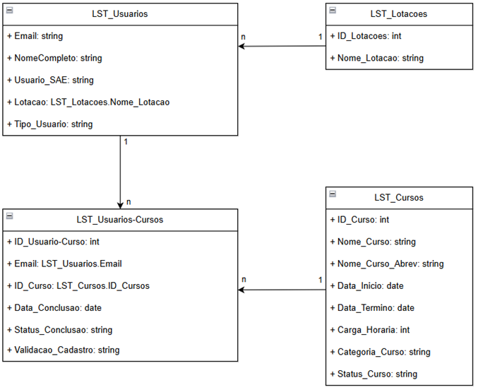

# Data Hub - ESAE


> Uma Plataforma para Análise de Usuários e Cursos, desenvolvida com Power Apps, Power Automate e Office Scripts para a ESAE-PGE/RS.

---

## 📖 Índice

1.  [**Sobre o Projeto**](#-sobre-o-projeto)
2.  [**Funcionalidades Principais**](#-funcionalidades-principais)
3.  [**Resultados Obtidos**](#-resultados-obtidos)
4.  [**Tecnologias e Arquitetura**](#-tecnologias-e-arquitetura)
5.  [**Estrutura de Pastas**](#-estrutura-de-pastas)
6.  [**Roadmap de Evolução**](#-pontos-de-atenção-e-roadmap-de-evolução)
7.  [**Documentação Detalhada**](#-documentação-detalhada)


---

## 🎯 Sobre o Projeto

O **Data Hub ESAE** é uma plataforma de automação e análise de dados construída sobre o ecossistema Microsoft Power Platform. O projeto nasceu para resolver o desafio de um processo de consolidação de dados que era manual, demorado e sujeito a erros, **levando dias** para ser concluído. A solução automatizada transformou este cenário, **reduzindo o tempo de processamento em 98% (de dias para minutos)** e criando uma fonte de dados única, confiável e interativa para a gestão.

---

## ✨ Funcionalidades Principais

* ✅ **Centralização de Dados:** Consolida informações de fontes distintas (Moodle, SAE) em uma base de dados única e padronizada.
* ✅ **Automação de ETL de Ponta a Ponta:** Automatiza todo o processo de Extração, Transformação (limpeza com Office Scripts) e Carga (sincronização com SharePoint via Power Automate).
* ✅ **Gestão e Visualização 360°:** Permite a visualização, pesquisa e filtragem do histórico de usuários e suas participações em cursos.
* ✅ **Sincronização Inteligente:** Gerencia o ciclo de vida dos registros, realizando operações de criação, atualização e inativação de forma automática.
* ✅ **Análise e Dashboards:** Oferece um cockpit de controle em **Power BI** e **Power Apps** com visões gerenciais, gráficos interativos e KPIs.
* ✅ **Auditoria de Dados:** Inclui funcionalidades e automações para reconciliar dados de diferentes fontes.

---

## 🚀 Resultados de Impacto

* ✅ **Ganho de Eficiência Exponencial:** Automação de ponta a ponta do fluxo de processamento de dados, **reduzindo o tempo de execução de dias para minutos (-98%)** e eliminando horas de retrabalho manual da equipe.
* ✅ **Agilidade na Tomada de Decisão:** Substituição de relatórios estáticos e demorados por dashboards em **Power BI conectados a uma base centralizada e confiável**, permitindo análises gerenciais em tempo quase real.
* ✅ **Governança e Confiabilidade dos Dados:** Criação de uma **fonte única da verdade (Single Source of Truth)** para todos os dados de cursos e usuários, garantindo a consistência e a integridade das informações para toda a instituição.

---

## 🛠️ Tecnologias e Arquitetura

A arquitetura do sistema é baseada em quatro pilares principais, orquestrados pelo ecossistema Power Platform.

* **Pilar 1: Camada de Dados (SharePoint Online):** Atua como a base de dados central, utilizando um modelo relacional com listas interligadas.
* **Pilar 2: Camada de Transformação de Dados (Office Scripts):** Realiza a limpeza e padronização dos relatórios brutos.
* **Pilar 3: Camada de Orquestração e Automação (Power Automate):** É o motor que automatiza todo o fluxo de trabalho, executando scripts e sincronizando dados.
* **Pilar 4: Camada de Apresentação e Análise (Power Apps):** Serve como a interface para consulta, visualização e análise dos dados.

---

## 📁 Estrutura de Pastas

```
🏛️ Projeto-ESAE-Data-Hub/
├── 📁 Documentacao/
│    ├── 📁 Imagens/                     # Capturas de tela e diagramas utilizados nos documentos.
│    ├── 📁 Scripts/                     # Códigos-fonte (.ts) dos Office Scripts.
│    ├── 📜 Arquitetura_de_Dados.md      # Detalhes do Banco de Dados.
│    ├── 📜 Telas.md                     # Descrição funcional de cada tela do Power App.
│    ├── 📜 Fluxo_Auditor.md             # Descrição detalhada do fluxo auditor.
│    ├── 📜 Fluxo_Usuarios_Moodle.md     # Descrição detalhada do fluxo moodle.
│    └── 📜 Fluxo_SAE.md                 # Descrição detalhada do fluxo SAE.
│
├── 📜 CHANGELOG.md                      # Histórico completo de versões e alterações.
├── 📜 KNOWN_ISSUES.md                   # Lista de problemas conhecidos, bugs e limitações atuais.
└── 📜 README.md                         # Este arquivo: o ponto de partida e resumo do projeto.
```

---

## 📚 Banco de Dados

A camada de dados foi implementada utilizando **Listas do SharePoint Online**, configuradas para simular um modelo de banco de dados relacional.

Incluir esta parte e mover a montagem para um segundo documento

A camada de dados foi implementada utilizando **Listas do SharePoint Online**. As principais são:

* `LST_Usuarios`
* `LST_Cursos`
* `LST_Lotacoes`
* `LST_Usuarios_SAE`
* `LST_Usuarios-Cursos`

---

### 📊 Diagrama de Entidade-Relacionamento

O diagrama abaixo representa a estrutura relacional das listas do SharePoint da concepção do projeto.



---

## 🎯 Pontos de Atenção e Roadmap de Evolução

Esta seção documenta áreas que exigem monitoramento e possíveis melhorias futuras.

* **Escalabilidade da Camada de Dados:** A solução atual utiliza o SharePoint. Com o aumento massivo de volume de dados, uma futura evolução seria migrar a base para o **Microsoft Dataverse** ou um banco de dados **Azure SQL** para otimizar a performance em larga escala.
* **Limites de Delegação do Power Apps:** É crucial que todas as novas consultas e filtros no aplicativo sejam construídos utilizando funções delegáveis para garantir que toda a base de dados seja analisada, e não apenas os primeiros 2.000 (powerapp) / 5.0000 (sharepoint) registros.
* **Monitoramento e Tratamento de Erros:** Implementar um sistema de log e notificação mais robusto no Power Automate para capturar e relatar falhas durante o processo de sincronização de forma proativa.
* **Ferramenta de Mesclagem de Lotações:** Desenvolver a funcionalidade planejada para permitir que administradores unifiquem registros de lotações inconsistentes.

---

## 📄 Documentação Técnica

Toda a documentação técnica e funcional do projeto foi separada em arquivos específicos para maior clareza e organização.

* **➡️ [Documentação Inicial do Projeto](./Documentacao/projeto_inicial_esae_data_hub.pdf):** Contém os detalhes da documentação de concepção do projeto.
* **➡️ [Arquitetura de Dados](./Documentacao/Arquitetura_de_dados.md):** Detalha o Banco de Dados (listas do SharePoint).
* **➡️ [Telas do PowerAPPs](./Documentacao/Telas_do_aplicativo.md):** Contém a descrição funcional de cada uma das 15+ telas do Power App, com suas lógicas e imagens.
* **➡️ [Dashboard em Power BI](./Documentacao/Dashboard_-_Power_BI.md):** Detalha a modelagem de dados, funções DAX utilizadas e as metodologias aplicadas na construção do painel.
* **➡️ [Histórico de Alterações (CHANGELOG)](./CHANGELOG.md):** Registra todas as mudanças e novas funcionalidades a cada versão.
* **➡️ [Problemas Conhecidos (KNOWN_ISSUES)](./KNOWN_ISSUES.md):** Lista as limitações atuais e o roadmap de correções e melhorias.

### Power Automate
* **➡️ [Fluxo Auditor](./Documentacao/Fluxo_Auditor.md):** Descrição de funcionamento e montagem do fluxo no power automate.
* **➡️ [Fluxo SAE](./Documentacao/Fluxo_SAE.md):** Descrição de funcionamento e montagem do fluxo no power automate.
* **➡️ [Fluxo Moodle](./Documentacao/Fluxo_Moodle.md):** Descrição de funcionamento e montagem do fluxo no power automate.

### Office Scripts
* **➡️ [Script Usuarios](./Documentacao/PA-Usuarios-v2.ts):** Código completo com descrição versionamento e detalhes comentados
* **➡️ [Script Usuarios Externos](./Documentacao/Scripts/PA-SAE-CGAJAPDI-Servidores-v2.ts):** Código completo com descrição versionamento e detalhes comentados

